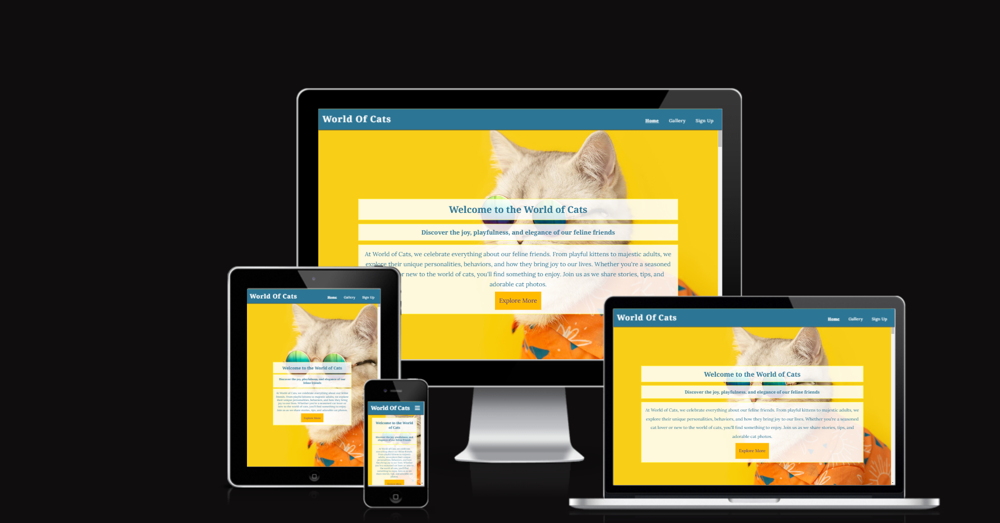
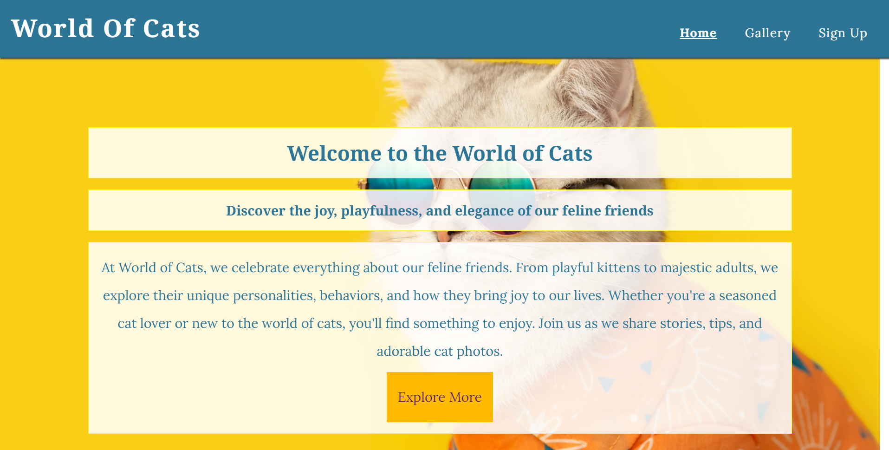
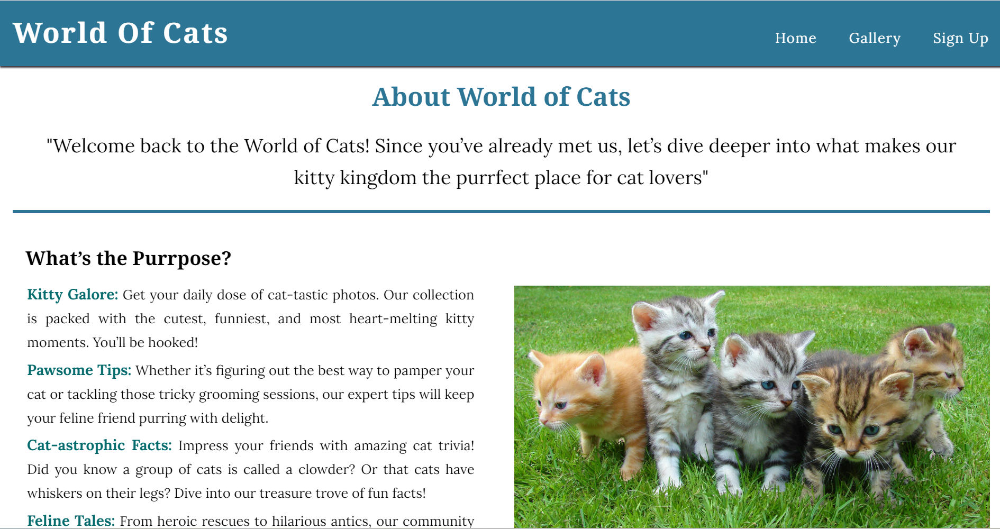
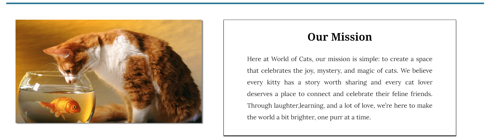
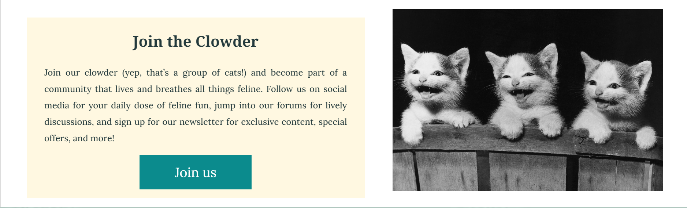
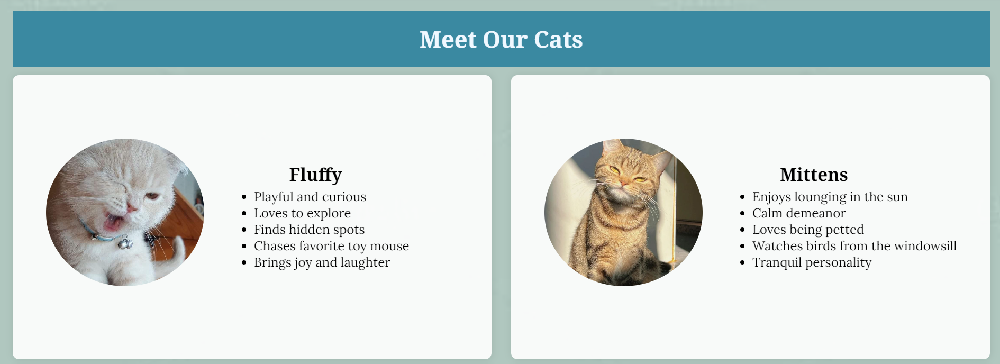
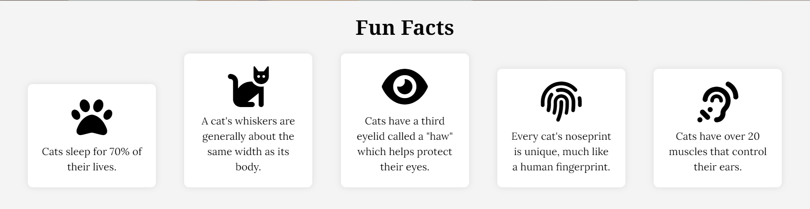
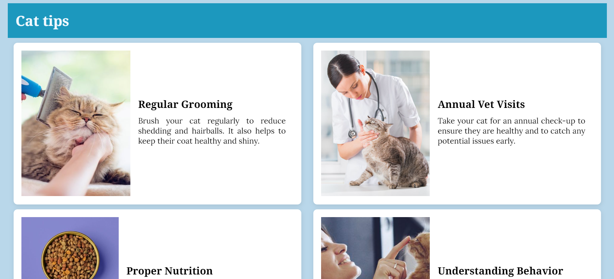
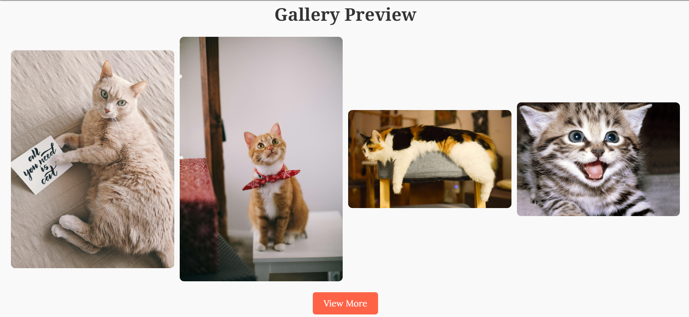
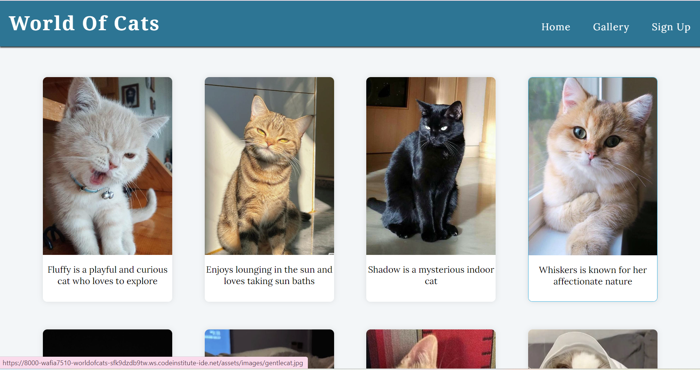

# [WORLDOFCATS](https://wafia7510.github.io/worldofcats)

Welcome to World of Cats, a comprehensive and engaging platform dedicated to all things feline. This project aims to create a vibrant online community for cat enthusiasts, offering a rich array of features designed to entertain, inform, and connect users who share a passion for cats.

### Purpose and Goals
World of Cats is more than just a website; it's a sanctuary for cat lovers. Our goal is to provide an informative and interactive space where users can explore various aspects of cat ownership and appreciation. Whether you are a seasoned cat owner, considering adopting a new furry friend, or simply an admirer of cats, our platform has something to offer you.

### Target Audience
- **Cat Owners:** Individuals who own cats and are looking for tips on care, health, and activities to keep their cats happy and healthy.
- **Cat Enthusiasts:** Anyone who loves cats and enjoys learning fun facts, viewing adorable cat photos, and engaging with a community of like-minded individuals.

source: [amiresponsive](https://ui.dev/amiresponsive?url=https://wafia7510.github.io/worldofcats)

## UX

### Colour Scheme

- `#000000` used for primary text.
- `#f4f4f4` used for primary highlights.
- `#2d7594` used for secondary text.
- `#ffffff` used for secondary highlights.

### Typography

- [Noto](https://fonts.googleapis.com/css2?family=Lora:ital,wght@0,400..700;1,400..700&family=Noto+Serif:ital,wght@0,100..900;1,100..900&display=swap) was used for the primary headers and titles.

- [Lora](https://fonts.googleapis.com/css2?family=Lora:ital,wght@0,400..700;1,400..700&display=swap) was used for all other secondary text.

- [Font Awesome](https://fontawesome.com) icons were used throughout the site, such as the social media icons in the footer.

## Features
The "World of Cats" website is a dedicated platform for cat enthusiasts, designed to share knowledge, joy, and the unique charm of our feline friends. The website is crafted to cater to cat lovers who seek information, entertainment, and community interaction around cats. Below is a detailed description of the different sections and features of the website, along with their value to the user.

### Existing Features

- **Hero Section-#1**

    - The Hero section is at the top of the homepage, providing a brief introduction to the world of cats. It includes a welcoming message, a captivating background image, and a call-to-action button.
    - This section immediately captures the user’s attention with a welcoming message and sets the stage for what the website is all about. It introduces the theme of the website and encourages users to explore further.

- **About Us Section-#2**

    - The About section introduces users to the mission and vision of the World of Cats community.
    - This section helps users understand the purpose of the website and feel connected to a community of like-minded cat lovers. It sets the tone for the user experience, welcoming them to explore further.

- **Cat Profiles-#3**

    - The Cat Profiles section showcases individual cat profiles with their pictures, names, and fun facts about their personalities. Each profile includes an image, a heading with the cat's name, and a list of interesting details
    -This feature provides users with engaging content about various cats, each with a unique personality and story. It fosters a deeper connection and understanding of different cat breeds and behaviors.

- **Fun Facts-#4**

    - The Fun Facts section shares interesting and lesser-known facts about cats in an engaging format.
    - This section educates users about cats in an enjoyable and engaging manner, enhancing their knowledge and appreciation of feline characteristics and behaviors.

- **Cat Tips-#5**

    - The Cat Tips section offers practical advice and tips for cat care, behavior management, and health. It includes bullet points of useful tips for cat owners.
    - This feature is valuable for cat owners and potential owners looking for reliable and practical information to take better care of their pets.

- **Gallery-#6**

    - The Gallery section displays a collection of beautiful cat pictures in a visually appealing layout.
    - The gallery provides visual delight to users, showcasing the beauty and diversity of cats. It is a source of enjoyment and inspiration for cat lovers.

- **Gallery Page-#6**

    - The Gallery page offers an extended collection of cat images, organized for easy browsing.
    - This dedicated page allows users to immerse themselves in a larger collection of cat photographs, enhancing their experience and engagement with the website.

- **Sign Up Page-#6**

    - The Sign Up page features a form for users to join the World of Cats community. It includes fields for personal information and preferences.
    - This feature facilitates community building by allowing users to sign up for newsletters, updates, and special content. It helps users stay connected and engaged with the website.

### Future Features

- Interactive Cat Quiz-#1
    - A quiz that tests users' knowledge about cats with fun and educational questions.
- User-Generated Content-#2
    - A platform where users can submit their own cat stories, pictures, and videos..
- Cat Care Videos-#3
    -  A library of instructional videos on various aspects of cat care, from grooming to training.

## Tools & Technologies Used
-  used to generate README and TESTING templates.
-  used for version control. (`git add`, `git commit`, `git push`)
-  used for secure online code storage.
-  used as a cloud-based IDE for development.
-  used for the main site content.
-  used for the main site design and layout.
-  used for hosting the deployed front-end site.
-  used for creating wireframes.
-  used for the icons.
-  used to help debug, troubleshoot, and explain things.

## Testing

> [!NOTE]  
> For all testing, please refer to the [TESTING.md](TESTING.md) file.

## Deployment

The site was deployed to GitHub Pages. The steps to deploy are as follows:

- In the [GitHub repository](https://github.com/wafia7510/worldofcats), navigate to the Settings tab 
- From the source section drop-down menu, select the **Main** Branch, then click "Save".
- The page will be automatically refreshed with a detailed ribbon display to indicate the successful deployment.

The live link can be found [here](https://wafia7510.github.io/worldofcats)

### Local Deployment

This project can be cloned or forked in order to make a local copy on your own system.

#### Cloning

You can clone the repository by following these steps:

1. Go to the [GitHub repository](https://github.com/wafia7510/worldofcats) 
2. Locate the Code button above the list of files and click it 
3. Select if you prefer to clone using HTTPS, SSH, or GitHub CLI and click the copy button to copy the URL to your clipboard
4. Open Git Bash or Terminal
5. Change the current working directory to the one where you want the cloned directory
6. In your IDE Terminal, type the following command to clone my repository:
	- `git clone https://github.com/wafia7510/worldofcats.git`
7. Press Enter to create your local clone.

Alternatively, if using Gitpod, you can click below to create your own workspace using this repository.

Please note that in order to directly open the project in Gitpod, you need to have the browser extension installed.
A tutorial on how to do that can be found [here](https://www.gitpod.io/docs/configure/user-settings/browser-extension).

#### Forking

By forking the GitHub Repository, we make a copy of the original repository on our GitHub account to view and/or make changes without affecting the original owner's repository.
You can fork this repository by using the following steps:

1. Log in to GitHub and locate the [GitHub Repository](https://github.com/wafia7510/worldofcats)
2. At the top of the Repository (not top of page) just above the "Settings" Button on the menu, locate the "Fork" Button.
3. Once clicked, you should now have a copy of the original repository in your own GitHub account!

### Local VS Deployment

When developing World of Cats, two key environments were utilized: the local development setup and the live deployment on GitHub Pages. Each environment plays a crucial role in the development and presentation of the site.

### Local Version:
Local provides a flexible and iterative workflow, enabling developers to address issues and refine features efficiently. This environment is ideal for fine-tuning design and functionality before going live.

### Deployment:
Deployment ensures that the site is accessible globally, providing a polished and consistent user experience. It also allows for performance optimization and user feedback collection, reflecting the site’s performance in a real-world setting.

## Credits

In developing the World of Cats website, various resources were used to enhance content, design, and functionality. Here is a list of the sources and tools that contributed to the project:

- **Pinterest:**
 For design inspiration and ideas related to cat-themed visuals and layouts.
- **ChatGPT:**
 For generating content, including text descriptions and feature explanations, as well as providing coding guidance.
- **W3Schools:**
 For web development tutorials and reference materials on HTML, CSS, and JavaScript.
- **Pexels:**
 Provided high-quality free stock photos used throughout the website. Pexels
- **Lorem Picsum:**
 Offered placeholder images for development and testing purposes. Lorem Picsum
- **Unsplash:** 
Supplied high-resolution images that were utilized to enrich the visual appeal of the site. Unsplash
- **Pixabay:**
 Provided additional free images and illustrations to enhance the website's content. Pixabay
- **Love Running Project:** 
Contributed styling techniques and design elements incorporated into the website to improve its aesthetic appeal and user experience.

### Content

| Source | Location | Notes |
| --- | --- | --- |
| [Markdown Builder](https://tim.2bn.dev/markdown-builder) | README and TESTING | tool to help generate the Markdown files |
| [W3Schools](https://www.w3schools.com/css/css_dropdowns.asp) | dropdown menu | Consulted for implementing CSS modals in the dropdown menu |
| [ChatGpt](https://chatgpt.com/) | columns for gallery in homepage in media query| Learned the usage of calc() in media queries for responsive design |
| [ChatGpt](https://chatgpt.com/) | fun facts section| Developed ideas on how the fun facts section should be visually and functionally designed |

### Media

| Source | Location | Type | Notes |
| --- | --- | --- | --- |
| [Pexels](https://www.pexels.com) | gallery page | image | cat images all pages |
| [Lorem Picsum](https://picsum.photos) | home page | image | hero image background |
| [Unsplash](https://unsplash.com) | cat wallpaper | image | cat wallpaper for cat profile background|
| [Pixabay](https://pixabay.com) | gallery page | image | group of photos for gallery |
| [Pinterest](https://www.pinterest.co.uk/) | gallery page | image | group of photos for gallery |

### Acknowledgements

- I would like to thank my Code Institute mentor, [Tim Nelson](https://github.com/TravelTimN) for his support throughout the development of this project.
- I would like to thank the [Code Institute](https://codeinstitute.net) tutor team for their assistance with troubleshooting and debugging some project issues.
- I would like to thank the [Code Institute Slack community](https://code-institute-room.slack.com) for the moral support; it kept me going during periods of self doubt and imposter syndrome.
- I would like to thank my partner (John/Jane), for believing in me, and allowing me to make this transition into software development.
- I would like to thank my employer, for supporting me in my career development change towards becoming a software developer.
