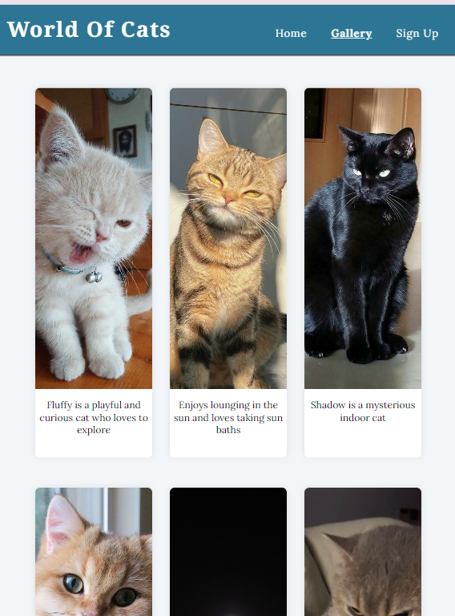

# Testing

> [!NOTE]  
> Return back to the [README.md](README.md) file.

Feature-by-Feature Testing:

- Navigation:Ensures smooth transitions between pages and links directing to the correct destinations.Testing process includes checking from home to gallery, gallery to sign up and vice versa, checking to drop-down menu and lastly checking the bookmark links.All navigation links work as intended, providing a seamless user experience.
- Responsive Design: Checking for compatibility across various devices and screen sizes and verified That site maintains a consistent and functional layout across all tested devices, ensuring accessibility for all users.
- Portfolio Display: Ensured each cat-related project is displayed with the correct title, image, and description,checked that images are high-resolution and load correctly and lastly verified that clicking on project images or titles direct users to the detailed project page or external links to social media websites.
- Contact Form: Form Submission: Filled out and submitted the contact form with test data and verified that users receive a confirmation message upon submission.

User Experience Testing:

- Usability Testing: Conducted internal usability testing where I and my mentor interacted with the site.Found that the navigation was intuitive and smooth,Verified that the content was engaging and well-organized and Feedback from internal testing was positive and confirming that the site is user-friendly.
- Accessibility Testing: Verified that all images have descriptive alt text and ensured that the site can be navigated using keyboard shortcuts.

Compatibility Testing:

- Browser Compatibility:Tested the site on different browsers (Chrome, Firefox, Opera).
- Device Compatibility: Ensuring functionality across various devices (desktops, laptops, tablets, and mobile phones).

Regression Testing:

After implementing fixes or updates, ensure that previous features and functionalities still work as intended and No new issues were introduced, confirming that the site remains stable and functional after updates.

Documentation and Logs:

Maintain records of testing procedures, results, and any bugs encountered along with their resolutions. This helps demonstrate a systematic approach to testing and problem-solving.

User Feedback Incorporation:

Incorporated feedback from internal testing conducted by myself and my mentor and  ensuring it meets user needs effectively.

## Code Validation

### HTML

I have used the recommended [HTML W3C Validator](https://validator.w3.org) to validate all of my HTML files.

| Directory | File | Screenshot | Notes |
| --- | --- | --- | --- |
|  | 404.html |  | |
|  | confirmation.html |  | |
|  | gallery.html |  | |
|  | index.html |  | |
|  | signup.html |  | |

### CSS

I have used the recommended [CSS Jigsaw Validator](https://jigsaw.w3.org/css-validator) to validate all of my CSS files.

| Directory | File | Screenshot | Notes |
| --- | --- | --- | --- |
| assets | styles.css |  | |

## Browser Compatibility

I've tested my deployed project on multiple browsers to check for compatibility issues.

| Browser | Home | About | Contact | etc | Notes |
| --- | --- | --- | --- | --- | --- |
| Chrome |  |  |  | Works as expected |
| Firefox |  |  |  | Works as expected |

| Opera |  |  |  |  | Minor differences |

## Responsiveness

I've tested my deployed project on multiple devices to check for responsiveness issues.

| Device | Home | About | Contact  | Notes |
| --- | --- | --- | --- | --- |
| Mobile (DevTools) |  |  |  | Works as expected |
| Tablet (DevTools) |  |  |  | Works as expected |
| Desktop |  |  |  | | Works as expected |

## Lighthouse Audit

I've tested my deployed project using the Lighthouse Audit tool to check for any major issues.

| Page | Mobile | Desktop | Notes |
| --- | --- | --- | --- |
| Home |  |  |  |
| Gallery |  |  |  |
| Sign up|  |  |  |

## Bugs

- On screens larger than 1400px, the layout of the website stretches disproportionately, causing elements to misalign and affect the overall design and usability of the site.

-Several commit messages in the version control history do not adhere to the standard set by the Code Institute. This impacts the clarity and traceability of changes made to the codebase.

## Unfixed Bugs
- Viewport Stretching on Screens Larger Than 1400px and its not fixed because Adequate testing on various screen sizes and devices needs to be conducted to confirm that changes address the problem effectively without introducing new issues.

- Non-Standard Commit Messages was the result of lack of awareness or understanding of the required commit message standards of code institue.After discussing with my mentor, it has been noted that recent commit messages have shown significant improvement. The team has made progress in aligning with the Code Institute’s standards, with a more consistent and descriptive format now being used.

> [!NOTE]  
> There are no remaining bugs that I am aware of.
